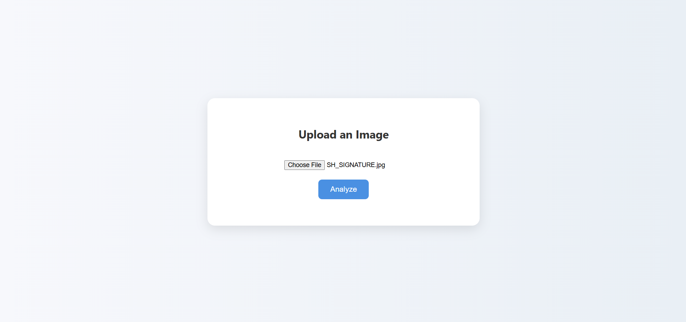
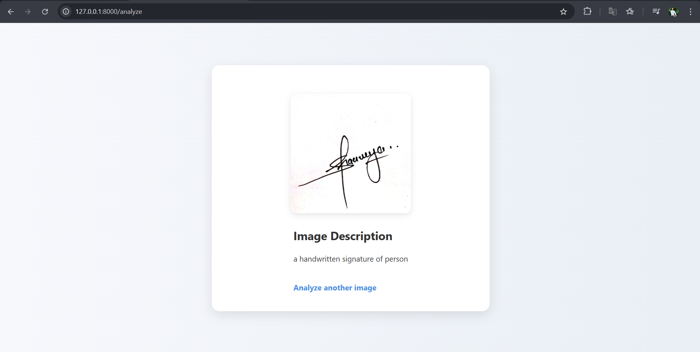

# 🖼️ Image Analyzer — Offline AI Image Captioning App (FastAPI + BLIP)

This project is a simple and beautiful web app that allows users to upload an image and get an AI-generated description of the image — all running locally on your machine without any cloud API.

It uses **FastAPI** for the backend, **Jinja2** for HTML rendering, and the **BLIP image captioning model** from Hugging Face to generate descriptions for the uploaded images.

✅ Works fully **offline**  
✅ Supports `.jpg`, `.jpeg`, and `.png` images  
✅ Mobile-friendly & clean UI  
✅ Lightweight — runs on low RAM (even 512MB RAM on Render Free Tier)  

---

## 📂 Project Structure

image-analyzer/
├── app.py # FastAPI backend logic
├── image_caption.py # Image captioning using BLIP model
├── requirements.txt # Python dependencies
├── static/ # CSS styling
│ └── style.css
├── templates/ # HTML templates
│ ├── index.html
│ └── result.html
└── README.md # You're reading it!

## 🚀 How to Run This App on Your Own Device
git clone https://github.com/your-username/image-analyzer.git
cd image-analyzer

pip install -r requirements.txt

uvicorn app:app --reload

http://127.0.0.1:8000
Upload an image to see the AI-generated description!
